# Arsitektur & Alur Sistem Latihan Soal (StudyFlow)

## 1. High-Level System Architecture

Berikut adalah gambaran besar bagaimana data mengalir dari mentahan (PDF) sampai ke User Interface.

```mermaid
graph TD
    %% Subgraph: Content Pipeline (Back-Office)
    subgraph Content_Pipeline ["🏭 Content Pipeline (Admin/Seed)"]
        PDF[("📚 PDF Source (600 Pages)")] -->|Copy Text| Parser["🤖 AI/Regex Parser Tool"]
        Parser -->|Generate| JSON["📄 Structured JSON"]
        JSON -->|Seeding| Firestore_Q[("🔥 Firestore: Questions")]
    end

    %% Subgraph: User Experience
    subgraph User_Flow ["👤 User Experience"]
        Dashboard["🖥️ Dashboard Latihan"] -->|Select Subject| Setup["⚙️ Setup Config"]
        Setup -->|Start| Quiz_Engine["🎮 Quiz Engine (Client Side)"]
        
        Quiz_Engine -->|Fetch Questions| Firestore_Q
        Quiz_Engine -->|Submit Answers| Grading["📝 Grading System"]
        
        Grading -->|Calc Score & XP| Results["📊 Result & Analysis"]
        Results -->|Update Stats| Firestore_Stats[("🔥 Firestore: User Stats")]
    end

    %% Gamification Loop
    subgraph Gamification ["✨ Gamification Logic"]
        Stats_Check{"❤️ Health > 0?"}
        Grading --> Stats_Check
        Stats_Check -- "Yes" --> Full_XP["💰 Get 100% XP"]
        Stats_Check -- "No" --> Low_XP["💸 Get 10% XP (Focus Penalty)"]
        Low_XP --> Recharge["⚡ Recharge Task"]
    end
```



## 2. Detail Alur Data (Data Flow)

### A. Content Ingestion (PDF ke App)

Masalah utama adalah 600 halaman PDF. Kita tidak input manual satu per satu.

1. **Extraction**: Copy text per Bab/Paket dari PDF.
2. **Parsing**: Paste ke *Custom Parser Tool* (kita buat script sederhana). Tool ini akan memisahkan:
    * Teks Soal
    * Pilihan Ganda (A-E)
    * Kunci Jawaban
    * Pembahasan
3. **Validation**: Review JSON hasil generate.
4. **Upload**: Script upload JSON ke Firestore.

### B. Quiz Flow (Mode Santai & Waktu)

| Feature | Mode Santai (Zen) | Mode Waktu (Simulation) |
| :--- | :--- | :--- |
| **Timer** | Stopwatch (Count Up) | Countdown (Sesuai Durasi Asli) |
| **Feedback** | Di Akhir Semua | Di Akhir Semua |
| **Navigasi** | Bebas (Next/Prev) | Bebas |
| **Tekanan** | Rendah | Tinggi (Pacing Alert) |
| **Result** | Akurasi & Pemahaman | Skor IRT (Prediksi) & Speed |

## 3. Data Schema (Firestore)

### Collection: `questions`

```typescript
{
  id: "q_123",
  subjectId: "penalaran-umum",
  topicId: "deduktif",
  content: "Jika semua mahluk hidup...",
  options: [
    { id: "A", text: "Maka...", isCorrect: false },
    { id: "B", text: "Maka...", isCorrect: true }
  ],
  explanation: "Premis mayor adalah...",
  difficulty: "medium" // easy, medium, hard
}
```

### Collection: `user_attempts`

```typescript
{
  id: "att_456",
  userId: "user_001",
  subjectId: "penalaran-umum",
  mode: "time-battle",
  startedAt: Timestamp,
  finishedAt: Timestamp,
  score: 750, // Poin SNBT
  correctCount: 15,
  wrongCount: 5,
  answers: [
    { questionId: "q_123", answer: "B", isCorrect: true, timeSpentSeconds: 45 }
  ]
}
```

## 4. Focus Multiplier System (Gamification)

Menggantikan sistem "Nyawa Mati = Game Over".

1. **Initial State**: User punya 5/5 **Focus Point** (❤️).
2. **Wrong Answer**:
    * Dikurangi 1 ❤️.
    * Jika ❤️ > 0: XP Gain = 100%.
    * Jika ❤️ = 0: XP Gain = 10% (Penalty).
3. **Recovery**:
    * Otomatis: +1 ❤️ setiap 30 menit.
    * Manual: "Review Materi" (Baca rangkuman topik yang salah) -> Instant +2 ❤️.
