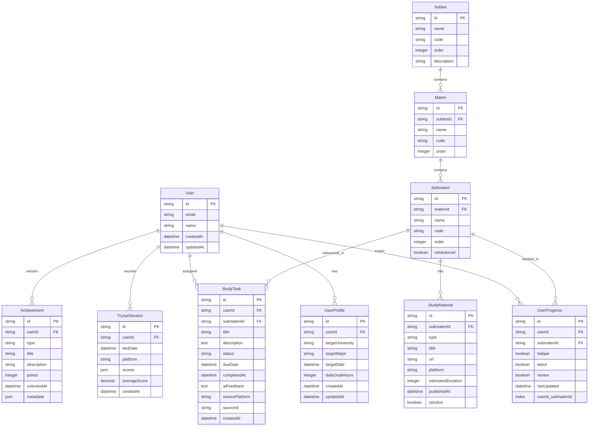

# STUDYFLOW PROJECT PLAN

# **PRODUCT REQUIREMENTS DOCUMENT (PRD) - STUDYFLOW**

## **1. Overview**
**Project Name:** StudyFlow  
**Tagline:** "From Spreadsheet to Supercharged SNBT Preparation"  
**Target User:** Pelajar SNBT 2026 yang saat ini menggunakan spreadsheet manual (TTL tracker)  
**Core Value:** Upgrade spreadsheet tracking ke dashboard interaktif dengan AI integration, gamification, dan real-time analytics

## **2. User Personas**
### **Primary Persona: Zain (Active SNBT Preparer)**
- **Background:** SMA kelas 12, target masuk ITB
- **Current Pain Points:**
  - Spreadsheet TTL statis dan tidak interaktif
  - Tidak ada reminder atau sistem tugas terintegrasi
  - Analytics manual, harus hitung sendiri progress
  - Tidak ada motivasi/gamification
- **Goals:** Efisiensi waktu tracking, insight otomatis, sistem belajar terstruktur

## **3. Feature Prioritization**

### **MVP (Weeks 1-2): Core Tracking System**
1. **Authentication & Profile Setup**
   - Email/password + Google OAuth
   - Input: Nama, PTN Tujuan, Jurusan, Target Date
   - Auto-calculate: Days remaining, recommended pace

2. **Materi Tracking (Spreadsheet Replacement)**
   - Hierarchical view: 7 Subtes → Materi → Submateri
   - Boolean checkboxes: Belajar ✓ | Latsol ✓ | Review ✓
   - Real-time aggregation: Persentase per subtes (mirip formula spreadsheet)

3. **Basic Dashboard**
   - Progress overview (cards, simple charts)
   - Today's agenda
   - Quick actions

### **V1 (Weeks 3-4): Analytics & Gamification**
1. **Tryout Analytics**
   - Input form for tryout results (date, platform, IRT scores)
   - Line charts per subtes progress
   - Weakness analysis

2. **Basic Gamification**
   - Points system (per submateri completed)
   - Streak tracking (daily login)
   - Simple achievements

3. **Material Hub (Basic)**
   - Static content per submateri
   - PDF/video resources

### **V2 (Weeks 5-6): Advanced Features & AI**
1. **Tugas System**
   - WhatsApp/Telegram integration
   - Task assignment & submission
   - AI feedback (basic)

2. **Advanced Gamification**
   - Leaderboard (optional)
   - Reward system
   - Physics-based celebration animations

3. **AI Integration**
   - Personalized recommendations
   - Weakness prediction
   - Study schedule optimization

## **4. Database Schema (Mermaid ERD)**



## **5. Technical Task Breakdown (JSON for Antigravity)**

```json
{
  "project": "StudyFlow",
  "phases": [
    {
      "name": "Phase 1: Foundation & Setup",
      "week": 1,
      "tasks": [
        {
          "id": "SETUP-001",
          "title": "Initialize Next.js 15 Project",
          "description": "Setup Next.js 15 with TypeScript, Tailwind CSS, shadcn/ui",
          "priority": "HIGH",
          "estimatedHours": 2,
          "dependencies": [],
          "files": ["package.json", "tsconfig.json", "tailwind.config.js", "components.json"]
        },
        {
          "id": "SETUP-002",
          "title": "Configure Database & Prisma",
          "description": "Setup PostgreSQL connection, Prisma schema, migrations",
          "priority": "HIGH",
          "estimatedHours": 3,
          "dependencies": ["SETUP-001"],
          "files": ["prisma/schema.prisma", ".env", "lib/db.ts"]
        },
        {
          "id": "SETUP-003",
          "title": "Implement Authentication",
          "description": "Setup NextAuth.js with Google & Email providers",
          "priority": "HIGH",
          "estimatedHours": 4,
          "dependencies": ["SETUP-002"],
          "files": ["app/api/auth/[...nextauth]/route.ts", "lib/auth.ts", "middleware.ts"]
        },
        {
          "id": "SETUP-004",
          "title": "Create Design System",
          "description": "Define tokens, colors, typography based on Digital Workbench aesthetic",
          "priority": "MEDIUM",
          "estimatedHours": 3,
          "dependencies": ["SETUP-001"],
          "files": ["lib/design-system.ts", "styles/globals.css", "components/ui/"]
        }
      ]
    },
    {
      "name": "Phase 2: Core Tracking Features",
      "week": 2,
      "tasks": [
        {
          "id": "CORE-001",
          "title": "Profile Setup Wizard",
          "description": "Create onboarding flow for target PTN, jurusan, deadline",
          "priority": "HIGH",
          "estimatedHours": 5,
          "dependencies": ["SETUP-003"],
          "files": ["app/onboarding/page.tsx", "components/onboarding/"]
        },
        {
          "id": "CORE-002",
          "title": "Submateri Hierarchy Component",
          "description": "Create tree view for 7 Subtes → Materi → Submateri",
          "priority": "HIGH",
          "estimatedHours": 8,
          "dependencies": ["SETUP-002", "SETUP-004"],
          "files": ["components/tracking/hierarchy-tree.tsx", "lib/data/materi-structure.ts"]
        },
        {
          "id": "CORE-003",
          "title": "Boolean Checkbox System",
          "description": "Interactive checkboxes for Belajar/Latsol/Review with real-time updates",
          "priority": "HIGH",
          "estimatedHours": 6,
          "dependencies": ["CORE-002"],
          "files": ["components/tracking/status-checkbox.tsx", "app/api/progress/route.ts"]
        },
        {
          "id": "CORE-004",
          "title": "Progress Aggregation Engine",
          "description": "Replicate spreadsheet formulas for percentage calculations",
          "priority": "HIGH",
          "estimatedHours": 4,
          "dependencies": ["CORE-003"],
          "files": ["lib/calculations/progress-calculator.ts", "lib/calculations/formulas.ts"]
        },
        {
          "id": "CORE-005",
          "title": "Main Dashboard Layout",
          "description": "Dashboard with progress cards, today's agenda, quick actions",
          "priority": "MEDIUM",
          "estimatedHours": 6,
          "dependencies": ["CORE-004", "SETUP-004"],
          "files": ["app/dashboard/page.tsx", "components/dashboard/"]
        }
      ]
    },
    {
      "name": "Phase 3: Analytics & Gamification",
      "week": 3,
      "tasks": [
        {
          "id": "ANALYTICS-001",
          "title": "Tryout Input Form",
          "description": "Form to input tryout results with validation",
          "priority": "HIGH",
          "estimatedHours": 4,
          "dependencies": ["CORE-005"],
          "files": ["components/analytics/tryout-form.tsx", "app/api/tryout/route.ts"]
        },
        {
          "id": "ANALYTICS-002",
          "title": "Chart Visualizations",
          "description": "Line charts for tryout progress, pie charts for submateri distribution",
          "priority": "HIGH",
          "estimatedHours": 5,
          "dependencies": ["ANALYTICS-001"],
          "files": ["components/analytics/charts/", "lib/chart-configs.ts"]
        },
        {
          "id": "ANALYTICS-003",
          "title": "Weakness Analysis Algorithm",
          "description": "Identify weakest subtes based on progress & tryout scores",
          "priority": "MEDIUM",
          "estimatedHours": 4,
          "dependencies": ["ANALYTICS-002"],
          "files": ["lib/analytics/weakness-detector.ts"]
        },
        {
          "id": "GAMIFICATION-001",
          "title": "Points System",
          "description": "Calculate points per completed submateri/tryout",
          "priority": "MEDIUM",
          "estimatedHours": 3,
          "dependencies": ["CORE-004"],
          "files": ["lib/gamification/points-calculator.ts"]
        },
        {
          "id": "GAMIFICATION-002",
          "title": "Streak Tracking",
          "description": "Daily login streak with visual indicator",
          "priority": "MEDIUM",
          "estimatedHours": 3,
          "dependencies": ["GAMIFICATION-001"],
          "files": ["lib/gamification/streak-tracker.ts", "components/gamification/streak-display.tsx"]
        },
        {
          "id": "GAMIFICATION-003",
          "title": "Achievement System",
          "description": "Milestone-based achievements with unlock logic",
          "priority": "LOW",
          "estimatedHours": 4,
          "dependencies": ["GAMIFICATION-001"],
          "files": ["lib/gamification/achievements.ts", "components/gamification/achievement-card.tsx"]
        }
      ]
    },
    {
      "name": "Phase 4: Advanced Features",
      "week": 4,
      "tasks": [
        {
          "id": "ADV-001",
          "title": "Material Hub",
          "description": "Content library with PDFs, videos per submateri",
          "priority": "MEDIUM",
          "estimatedHours": 6,
          "dependencies": ["CORE-002"],
          "files": ["app/materials/page.tsx", "components/materials/"]
        },
        {
          "id": "ADV-002",
          "title": "Tugas System UI",
          "description": "Task assignment, submission, and review interface",
          "priority": "HIGH",
          "estimatedHours": 8,
          "dependencies": ["CORE-005"],
          "files": ["app/tasks/page.tsx", "components/tasks/"]
        },
        {
          "id": "ADV-003",
          "title": "WhatsApp Webhook Integration",
          "description": "Receive task assignments via WhatsApp messages",
          "priority": "MEDIUM",
          "estimatedHours": 5,
          "dependencies": ["ADV-002"],
          "files": ["app/api/webhooks/whatsapp/route.ts", "lib/integrations/whatsapp-webhook.ts"]
        },
        {
          "id": "ADV-004",
          "title": "AI Feedback System",
          "description": "Basic AI grading for submitted tasks",
          "priority": "LOW",
          "estimatedHours": 6,
          "dependencies": ["ADV-002"],
          "files": ["lib/ai/grading.ts", "app/api/ai/feedback/route.ts"]
        }
      ]
    },
    {
      "name": "Phase 5: Polish & Performance",
      "week": 5,
      "tasks": [
        {
          "id": "POLISH-001",
          "title": "Theme Switching Animation",
          "description": "Smooth light/dark mode transitions (Digital Workbench aesthetic)",
          "priority": "MEDIUM",
          "estimatedHours": 4,
          "dependencies": ["SETUP-004"],
          "files": ["components/theme/theme-switcher.tsx", "hooks/use-theme.ts"]
        },
        {
          "id": "POLISH-002",
          "title": "Physics-based Animations",
          "description": "Celebration animations for achievements using Framer Motion",
          "priority": "LOW",
          "estimatedHours": 5,
          "dependencies": ["GAMIFICATION-003"],
          "files": ["components/animations/confetti.tsx", "components/animations/achievement-unlock.tsx"]
        },
        {
          "id": "POLISH-003",
          "title": "Performance Optimization",
          "description": "Optimize boolean updates, implement caching, batch operations",
          "priority": "HIGH",
          "estimatedHours": 6,
          "dependencies": ["CORE-003", "ANALYTICS-002"],
          "files": ["lib/optimizations/", "app/api/progress/batch/route.ts"]
        },
        {
          "id": "POLISH-004",
          "title": "Responsive Design Polish",
          "description": "Ensure mobile-friendly experience on all screens",
          "priority": "MEDIUM",
          "estimatedHours": 4,
          "dependencies": ["CORE-005"],
          "files": ["components/layout/responsive-container.tsx"]
        }
      ]
    }
  ]
}
```

## **6. Component Structure**

```
src/
├── app/
│   ├── (auth)/
│   │   ├── login/
│   │   └── register/
│   ├── (dashboard)/
│   │   ├── dashboard/
│   │   │   ├── page.tsx (main dashboard)
│   │   │   └── layout.tsx
│   │   ├── tracking/
│   │   │   ├── page.tsx (materi tracking)
│   │   │   └── [subtes]/
│   │   ├── analytics/
│   │   │   └── page.tsx (tryout analytics)
│   │   ├── tasks/
│   │   │   └── page.tsx (tugas system)
│   │   └── materials/
│   │       └── page.tsx (material hub)
│   ├── onboarding/
│   │   └── page.tsx (profile setup)
│   ├── api/
│   │   ├── auth/
│   │   ├── progress/
│   │   ├── tryout/
│   │   ├── tasks/
│   │   ├── webhooks/
│   │   └── ai/
│   └── layout.tsx (root layout with theme provider)
├── components/
│   ├── ui/ (shadcn components)
│   ├── dashboard/
│   │   ├── progress-cards.tsx
│   │   ├── stats-grid.tsx
│   │   ├── today-agenda.tsx
│   │   └── quick-actions.tsx
│   ├── tracking/
│   │   ├── hierarchy-tree.tsx
│   │   ├── status-checkbox.tsx
│   │   ├── progress-bar.tsx
│   │   └── subtes-navigation.tsx
│   ├── analytics/
│   │   ├── tryout-form.tsx
│   │   ├── charts/
│   │   │   ├── line-chart.tsx
│   │   │   ├── pie-chart.tsx
│   │   │   └── progress-chart.tsx
│   │   └── weakness-analysis.tsx
│   ├── gamification/
│   │   ├── points-display.tsx
│   │   ├── streak-display.tsx
│   │   ├── achievement-card.tsx
│   │   └── leaderboard.tsx
│   ├── tasks/
│   │   ├── task-list.tsx
│   │   ├── task-form.tsx
│   │   ├── submission-form.tsx
│   │   └── ai-feedback.tsx
│   ├── materials/
│   │   ├── material-card.tsx
│   │   ├── video-player.tsx
│   │   └── pdf-viewer.tsx
│   └── layout/
│       ├── sidebar.tsx
│       ├── header.tsx
│       └── theme-switcher.tsx
├── lib/
│   ├── db.ts (database client)
│   ├── auth.ts (authentication)
│   ├── design-system.ts (design tokens)
│   ├── calculations/
│   │   ├── progress-calculator.ts
│   │   └── formulas.ts (replicate spreadsheet formulas)
│   ├── analytics/
│   │   ├── weakness-detector.ts
│   │   └── trend-analysis.ts
│   ├── gamification/
│   │   ├── points-calculator.ts
│   │   ├── streak-tracker.ts
│   │   └── achievements.ts
│   ├── ai/
│   │   ├── grading.ts
│   │   └── recommendations.ts
│   ├── integrations/
│   │   ├── whatsapp-webhook.ts
│   │   └── telegram-bot.ts
│   └── optimizations/
│       ├── batch-updater.ts
│       └── cache-manager.ts
└── types/
    └── index.ts (TypeScript definitions)
```

## **7. API Endpoints List**

### **Authentication**
- `POST /api/auth/register` - User registration
- `POST /api/auth/login` - User login
- `POST /api/auth/logout` - User logout
- `GET /api/auth/session` - Get current session

### **User Profile**
- `GET /api/profile` - Get user profile
- `POST /api/profile` - Create/update profile
- `GET /api/profile/stats` - Get user statistics
- `GET /api/profile/streak` - Get current streak

### **Progress Tracking**
- `GET /api/progress` - Get all progress for user
- `GET /api/progress/subtes/:subtesId` - Get progress for specific subtes
- `POST /api/progress/batch` - Batch update progress (for checkbox updates)
- `PUT /api/progress/:submateriId` - Update specific submateri status
- `GET /api/progress/aggregate` - Get aggregated percentages (like spreadsheet)

### **Tryout Analytics**
- `GET /api/tryout` - Get all tryout sessions
- `GET /api/tryout/:id` - Get specific tryout
- `POST /api/tryout` - Create new tryout entry
- `PUT /api/tryout/:id` - Update tryout
- `DELETE /api/tryout/:id` - Delete tryout
- `GET /api/tryout/analytics/weakness` - Get weakness analysis
- `GET /api/tryout/analytics/trend` - Get trend analysis

### **Tasks System**
- `GET /api/tasks` - Get all tasks
- `GET /api/tasks/pending` - Get pending tasks
- `GET /api/tasks/:id` - Get specific task
- `POST /api/tasks` - Create new task
- `PUT /api/tasks/:id` - Update task
- `POST /api/tasks/:id/submit` - Submit task solution
- `GET /api/tasks/:id/feedback` - Get AI feedback

### **Materials**
- `GET /api/materials` - Get all materials
- `GET /api/materials/submateri/:submateriId` - Get materials for specific submateri
- `POST /api/materials` - Add new material (admin)
- `GET /api/materials/recommended` - Get recommended materials based on progress

### **Gamification**
- `GET /api/gamification/points` - Get user points
- `GET /api/gamification/achievements` - Get user achievements
- `POST /api/gamification/achievements/unlock` - Unlock achievement (internal)
- `GET /api/gamification/leaderboard` - Get leaderboard (optional)

### **Webhooks**
- `POST /api/webhooks/whatsapp` - Receive WhatsApp messages
- `POST /api/webhooks/telegram` - Receive Telegram messages

### **AI Integration**
- `POST /api/ai/feedback` - Get AI feedback for task submission
- `POST /api/ai/recommendations` - Get personalized study recommendations

## **8. Performance Considerations**

### **Boolean Updates Optimization**
- Use **batch updates** for checkbox changes (debounced)
- Store progress as **bitmask** (3 bits: belajar|latsol|review) for compact storage
- Implement **optimistic updates** for instant UI feedback

### **Caching Strategy**
- **Redis** for frequently accessed data (progress aggregates, user stats)
- **CDN** for static materials (PDFs, videos)
- **SWR/React Query** for client-side caching

### **Database Indexing**
- Composite index on `UserProgress(userId, submateriId)`
- Index on `TryoutSession(userId, testDate)`
- Index on `StudyTask(userId, dueDate, status)`

### **Real-time Updates**
- **Supabase Realtime** for progress updates across devices
- **Server-Sent Events (SSE)** for notification updates
- **WebSocket** for collaborative features (future)

## **9. Integration Architecture**

### **WhatsApp/Telegram Bot Flow**
```
User sends message → Bot receives → Parse command → 
Create task in StudyFlow → Send confirmation → 
User submits via web → AI feedback → Bot notifies
```

### **AI Grading System**
```
Task submission → Extract text/image → 
LLM processing (GPT-4/Claude) → 
Rubric-based evaluation → Generate feedback → 
Store feedback → Notify user
```

### **Real-time Sync**
- Use **Supabase Realtime** for progress updates
- **Conflict resolution** using last-write-wins with timestamp
- **Offline support** with local storage sync

## **10. Next Steps**

1. **Start with Antigravity:** Import the JSON task checklist above
2. **Begin with Phase 1:** Foundation setup
3. **Seed Database:** Import the 7 subtes structure from spreadsheet
4. **Build Vertical Slice:** User auth → Profile setup → Basic tracking
5. **Iterate:** Weekly sprints based on the phases above

**Key Success Metrics:**
- 90%+ accuracy in replicating spreadsheet calculations
- Sub-200ms response time for progress updates
- 95%+ user satisfaction from spreadsheet migrants
- 30% increase in study consistency (via streak tracking)

**Risks & Mitigations:**
- **Complex formulas:** Test thoroughly with spreadsheet comparison
- **Scale:** Start with single user, optimize before scaling
- **AI costs:** Implement caching and limit free tier usage

---

**Delivery Timeline:** 6 weeks total  
**Week 1-2:** MVP (Core Tracking)  
**Week 3-4:** V1 (Analytics & Gamification)  
**Week 5-6:** V2 (Advanced Features & Polish)